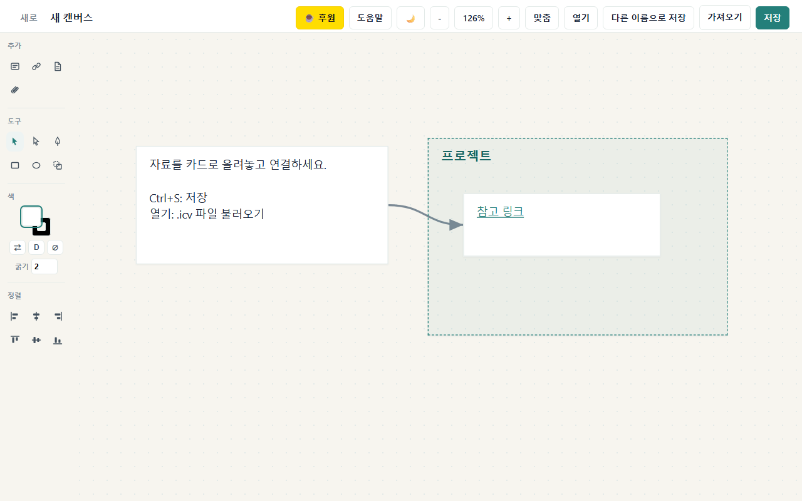

# ICE Canvas

**무한 캔버스 위에 메모·링크·파일·이미지·PDF·영상을 카드로 펼쳐 정리하는 데스크톱 앱.**
icenovel.com 홈페이지에 있던 캔버스 기능을, 설치해서 쓰는 Windows 프로그램으로 옮겼습니다.



<p align="center">
  <a href="https://github.com/icenovel-rgb/icecanvas/releases/latest"><b>⬇️ 최신 버전 다운로드 (Windows .msi)</b></a>
  &nbsp;·&nbsp;
  <a href="https://buymeacoffee.com/icenovel">☕ 개발자 후원</a>
</p>

<p align="center">
  
  
  
  
</p>

---

## 왜 만들었나

생각은 줄글이 아니라 공간에 흩어진다. 자료를 폴더에 묻어두는 대신,
**한 화면에 카드로 펼쳐놓고 선으로 잇는 것**이 훨씬 잘 보인다.
홈페이지에서 쓰던 캔버스가 마음에 들어서, 인터넷 없이 내 PC에서 바로 쓰도록
가벼운 데스크톱 앱으로 다시 만들었다. 파일은 `.icv`로 내 컴퓨터에 저장된다 — **온전히 내 것.**

## 기능

- 🗂 **카드형 노드** — 텍스트(마크다운)·링크·파일·이미지·PDF·영상·그룹을 자유롭게 배치
- 🔗 **연결선(엣지)** — 카드끼리 화살표로 이어 관계를 그린다
- ✏️ **벡터 도구** — 펜·사각형·원·색칠·정렬, 그룹 묶기/풀기
- 💾 **내 파일로 저장** — `.icv` 포맷 저장/열기 (옵시디언 호환을 위해 `.canvas`도 열림)
- 🌗 **다크 모드**, 줌·화면 맞춤, 단축키
- 🔒 **로컬·오프라인** — 서버·계정·추적 없음. 백그라운드 프로세스나 숨은 스크립트 없이 표준 Tauri 앱으로 동작
- 🪶 **가벼움** — 설치본 약 3MB, 실행 파일 8MB대 (Electron이 아닌 Tauri 2 + 시스템 WebView)

## 설치 (Windows 10/11 · x64)

1. [최신 릴리스](https://github.com/icenovel-rgb/icecanvas/releases/latest)에서 `ICE-Canvas-0.1.6-x64.msi`를 받는다.
2. 더블클릭해 설치한다. (표준 Tauri MSI — VBS 런처·숨은 PowerShell·로컬 HTTP 서버를 쓰지 않는다.)
3. 시작 메뉴에서 **ICE Canvas** 실행. `.icv`/`.canvas` 파일과 연결되어 더블클릭으로도 열린다.

## 사용법

- 왼쪽 레일에서 카드(텍스트·링크·PDF·파일)를 추가하고, 카드 가장자리를 끌어 연결한다.
- `Ctrl+S` 저장 · `열기`로 `.icv` 불러오기 · `다른 이름으로 저장`.
- 도움말 버튼에 단축키가 정리돼 있다.

## 개발

요구 사항: Node.js · Rust 툴체인 · Visual Studio Build Tools (C++).

```powershell
$env:PATH="$env:USERPROFILE\.cargo\bin;$env:PATH"
npm.cmd run build
```

생성된 MSI: `src-tauri\target\release\bundle\msi\`

구조:

- `ui/` — 앱 프런트엔드 (바닐라 JS 캔버스 엔진, 크롭, 네이티브 브리지)
- `src-tauri/` — Tauri 2 백엔드 (Rust), 번들·아이콘·파일 연결 설정
- `tests/` — 신뢰 불가 입력(.canvas) 처리 검증용 픽스처

## 보안

`.canvas`/`.icv` 파일은 **신뢰할 수 없는 입력**으로 다룬다. 강화된 CSP(`script-src 'self'`),
외부 링크는 안전한 http(s)만 시스템 브라우저로 여는 식으로 처리한다.

## 라이선스

[MIT](LICENSE) © 2026 서봉국 (icenovel). 자유롭게 쓰고 고치고 배포해도 된다.

## 만든 사람

서봉국 · [icenovel.com](https://icenovel.com) — "AI와 함께 만드는 것들을 기록한다."
도움이 됐다면 [☕ 후원](https://buymeacoffee.com/icenovel)으로 응원해 주세요.
